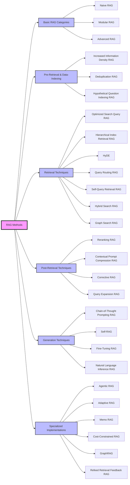

# 🚀 Comprehensive Guide to RAG Methods

This repository provides a structured overview of **Retrieval-Augmented Generation (RAG) methods** categorized into different techniques to enhance AI-driven retrieval and generation.

## 📌 **Basic RAG Categories**
1. **Naive RAG** – Basic retrieval without advanced enhancements.
2. **Modular RAG** – Separates retrieval and generation for flexibility.
3. **Advanced RAG** – Uses techniques like reranking, query optimization, and hierarchical indexing for better results.

## 🔍 **Pre-Retrieval & Data-Indexing Techniques**
4. **Increased Information Density RAG** – Uses LLMs to summarize and extract key information.
5. **Deduplication RAG** – Removes redundant information using clustering and merging techniques.
6. **Hypothetical Question Indexing RAG** – Generates hypothetical questions to improve retrieval efficiency.

## 📂 **Retrieval Techniques**
7. **Optimized Search Query RAG** – Restructures queries for better LLM understanding.
8. **Hierarchical Index Retrieval RAG** – Organizes data hierarchically for better retrieval.
9. **HyDE (Hypothetical Document Embeddings)** – Generates a hypothetical response first, then retrieves documents.
10. **Query Routing RAG (RAG Decider Pattern)** – Directs queries to the best retrieval method.
11. **Self-Query Retrieval RAG** – LLM generates follow-up queries for better accuracy.
12. **Hybrid Search RAG** – Combines keyword-based and semantic search.
13. **Graph Search RAG** – Uses knowledge graphs for retrieval.

## 🎯 **Post-Retrieval Techniques**
14. **Reranking RAG** – Ranks retrieved documents based on relevance.
15. **Contextual Prompt Compression RAG** – Compresses information to optimize LLM input.
16. **Corrective RAG (CRAG)** – Scores and filters retrieved documents for accuracy.
17. **Query Expansion RAG** – Expands user queries to improve retrieval.

## 🔥 **Generation Techniques**
18. **Chain-of-Thought Prompting RAG** – Guides the LLM with structured reasoning.
19. **Self-RAG** – Iteratively improves retrieval and generation.
20. **Fine-Tuning RAG** – Customizes the LLM with domain-specific data.
21. **Natural Language Inference (NLI) RAG** – Filters irrelevant context to prevent errors.

## ⚡ **Specialized RAG Implementations**
22. **Agentic RAG** – Uses AI agents for multi-step reasoning and retrieval.
23. **Adaptive RAG** – Adjusts retrieval and generation dynamically based on the query type.
24. **Memo RAG** – Retains past interactions for context-aware responses.
25. **Cost-Constrained RAG** – Balances retrieval cost and performance.
26. **GraphRAG** – Uses structured knowledge graphs for improved retrieval.
27. **Refeed Retrieval Feedback RAG** – Uses feedback loops to refine retrieval over time.

---

## 📌 **RAG Methods Overview (Mermaid Diagram)**
Below is a **visual representation** of the RAG methods using a **Mermaid flowchart**:

---

## 🤝 Contribution

We welcome contributions to improve this repository! If you'd like to contribute:
1. **Fork the repository** and create a new branch.
2. **Make your changes**, ensuring they align with the project’s goals.
3. **Submit a Pull Request** and include a clear description of the update.

### 📢 Guidelines
- Follow best coding practices and format your code properly.
- Keep documentation clear and concise.
- Ensure any added examples are functional and well-documented.

### 💡 Want to Contribute?
Check out the **Issues** section for open tasks or propose a new feature!
