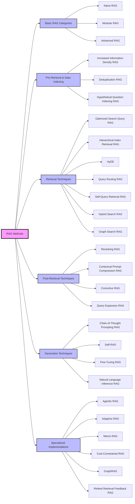
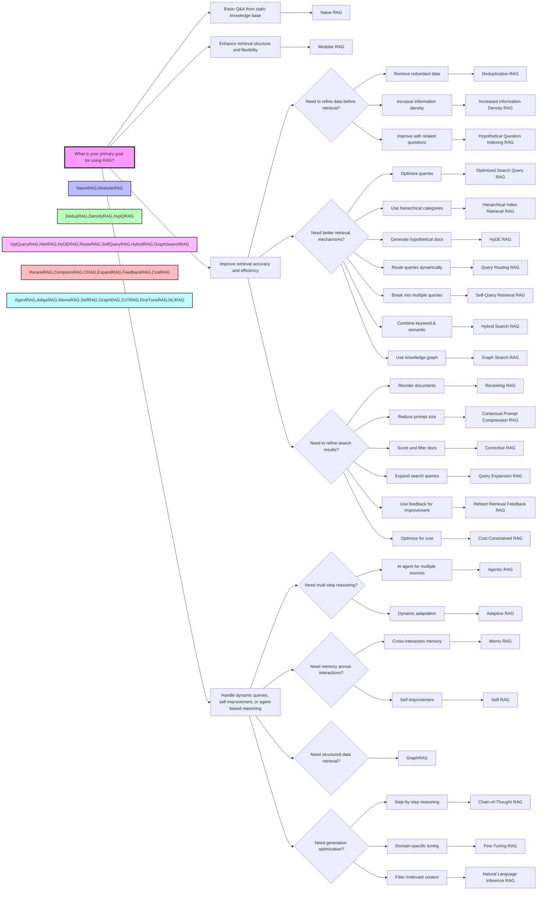

# üöÄ Comprehensive Guide to RAG Methods

This repository provides a structured overview of **Retrieval-Augmented Generation (RAG) methods** categorized into different techniques to enhance AI-driven retrieval and generation.

## üìå **Basic RAG Categories**
1. **Naive RAG** – Basic retrieval without advanced enhancements.
2. **Modular RAG** – Separates retrieval and generation for flexibility.
3. **Advanced RAG** – Uses techniques like reranking, query optimization, and hierarchical indexing for better results.

## üîç **Pre-Retrieval & Data-Indexing Techniques**
4. **Increased Information Density RAG** – Uses LLMs to summarize and extract key information.
5. **Deduplication RAG** – Removes redundant information using clustering and merging techniques.
6. **Hypothetical Question Indexing RAG** – Generates hypothetical questions to improve retrieval efficiency.

## 📂 **Retrieval Techniques**
7. **Optimized Search Query RAG** – Restructures queries for better LLM understanding.
8. **Hierarchical Index Retrieval RAG** – Organizes data hierarchically for better retrieval.
9. **HyDE (Hypothetical Document Embeddings)** – Generates a hypothetical response first, then retrieves documents.
10. **Query Routing RAG (RAG Decider Pattern)** – Directs queries to the best retrieval method.
11. **Self-Query Retrieval RAG** – LLM generates follow-up queries for better accuracy.
12. **Hybrid Search RAG** – Combines keyword-based and semantic search.
13. **Graph Search RAG** – Uses knowledge graphs for retrieval.

## 🎯 **Post-Retrieval Techniques**
14. **Reranking RAG** – Ranks retrieved documents based on relevance.
15. **Contextual Prompt Compression RAG** – Compresses information to optimize LLM input.
16. **Corrective RAG (CRAG)** – Scores and filters retrieved documents for accuracy.
17. **Query Expansion RAG** – Expands user queries to improve retrieval.

## üî• **Generation Techniques**
18. **Chain-of-Thought Prompting RAG** – Guides the LLM with structured reasoning.
19. **Self-RAG** – Iteratively improves retrieval and generation.
20. **Fine-Tuning RAG** – Customizes the LLM with domain-specific data.
21. **Natural Language Inference (NLI) RAG** – Filters irrelevant context to prevent errors.

## ‚ö° **Specialized RAG Implementations**
22. **Agentic RAG** – Uses AI agents for multi-step reasoning and retrieval.
23. **Adaptive RAG** – Adjusts retrieval and generation dynamically based on the query type.
24. **Memo RAG** – Retains past interactions for context-aware responses.
25. **Cost-Constrained RAG** – Balances retrieval cost and performance.
26. **GraphRAG** – Uses structured knowledge graphs for improved retrieval.
27. **Refeed Retrieval Feedback RAG** – Uses feedback loops to refine retrieval over time.

---

## üìå **RAG Methods Overview (Mermaid Diagram)**
Below is a **visual representation** of the RAG methods using a **Mermaid flowchart**:

```mermaid
flowchart LR
    RAG[RAG Methods] --> Basic[Basic RAG Categories]
    RAG --> PreRet[Pre-Retrieval & Data-Indexing]
    RAG --> Ret[Retrieval Techniques]
    RAG --> PostRet[Post-Retrieval Techniques]
    RAG --> Gen[Generation Techniques]
    RAG --> Spec[Specialized Implementations]

    Basic --> B1[Naive RAG]
    Basic --> B2[Modular RAG]
    Basic --> B3[Advanced RAG]

    PreRet --> P1[Increased Information Density RAG]
    PreRet --> P2[Deduplication RAG]
    PreRet --> P3[Hypothetical Question Indexing RAG]

    Ret --> R1[Optimized Search Query RAG]
    Ret --> R2[Hierarchical Index Retrieval RAG]
    Ret --> R3[HyDE]
    Ret --> R4[Query Routing RAG]
    Ret --> R5[Self-Query Retrieval RAG]
    Ret --> R6[Hybrid Search RAG]
    Ret --> R7[Graph Search RAG]

    PostRet --> PR1[Reranking RAG]
    PostRet --> PR2[Contextual Prompt Compression RAG]
    PostRet --> PR3[Corrective RAG]
    PostRet --> PR4[Query Expansion RAG]

    Gen --> G1[Chain-of-Thought Prompting RAG]
    Gen --> G2[Self-RAG]
    Gen --> G3[Fine-Tuning RAG]
    Gen --> G4[Natural Language Inference RAG]

    Spec --> S1[Agentic RAG]
    Spec --> S2[Adaptive RAG]
    Spec --> S3[Memo RAG]
    Spec --> S4[Cost-Constrained RAG]
    Spec --> S5[GraphRAG]
    Spec --> S6[Refeed Retrieval Feedback RAG]

    style RAG fill:#f9f,stroke:#333,stroke-width:4px
    style Basic fill:#bbf,stroke:#333,stroke-width:2px
    style PreRet fill:#bbf,stroke:#333,stroke-width:2px
    style Ret fill:#bbf,stroke:#333,stroke-width:2px
    style PostRet fill:#bbf,stroke:#333,stroke-width:2px
    style Gen fill:#bbf,stroke:#333,stroke-width:2px
    style Spec fill:#bbf,stroke:#333,stroke-width:2px
```

---

## üåê RAG Decision Tree

```mermaid
flowchart LR
    Start[What is your primary goal for using RAG?]
    
    Start --> Basic[Basic Q&A from static knowledge base]
    Start --> Accuracy[Improve retrieval accuracy and efficiency]
    Start --> Structure[Enhance retrieval structure and flexibility]
    Start --> Dynamic[Handle dynamic queries, self-improvement, or agent-based reasoning]
    
    Basic --> NaiveRAG[Naive RAG]
    Structure --> ModularRAG[Modular RAG]
    
    %% Advanced RAG Methods - Pre-Retrieval
    Accuracy --> PreRet{Need to refine data before retrieval?}
    PreRet --> Dedup[Remove redundant data]
    PreRet --> Density[Increase information density]
    PreRet --> HypQ[Improve with related questions]
    
    Dedup --> DedupRAG[Deduplication RAG]
    Density --> DensityRAG[Increased Information Density RAG]
    HypQ --> HypQRAG[Hypothetical Question Indexing RAG]
    
    %% Advanced RAG Methods - Retrieval
    Accuracy --> Ret{Need better retrieval mechanisms?}
    Ret --> OptQuery[Optimize queries]
    Ret --> Hier[Use hierarchical categories]
    Ret --> HypDoc[Generate hypothetical docs]
    Ret --> Route[Route queries dynamically]
    Ret --> MultiQ[Break into multiple queries]
    Ret --> Hybrid[Combine keyword & semantic]
    Ret --> GraphS[Use knowledge graph]
    
    OptQuery --> OptQueryRAG[Optimized Search Query RAG]
    Hier --> HierRAG[Hierarchical Index Retrieval RAG]
    HypDoc --> HyDERAG[HyDE RAG]
    Route --> RouteRAG[Query Routing RAG]
    MultiQ --> SelfQueryRAG[Self-Query Retrieval RAG]
    Hybrid --> HybridRAG[Hybrid Search RAG]
    GraphS --> GraphSearchRAG[Graph Search RAG]
    
    %% Advanced RAG Methods - Post-Retrieval
    Accuracy --> PostRet{Need to refine search results?}
    PostRet --> Rerank[Reorder documents]
    PostRet --> Compress[Reduce prompt size]
    PostRet --> Filter[Score and filter docs]
    PostRet --> Expand[Expand search queries]
    PostRet --> Feedback[Use feedback for improvement]
    PostRet --> Cost[Optimize for cost]
    
    Rerank --> RerankRAG[Reranking RAG]
    Compress --> CompressRAG[Contextual Prompt Compression RAG]
    Filter --> CRAG[Corrective RAG]
    Expand --> ExpandRAG[Query Expansion RAG]
    Feedback --> FeedbackRAG[Refeed Retrieval Feedback RAG]
    Cost --> CostRAG[Cost-Constrained RAG]
    
    %% Specialized RAG Methods
    Dynamic --> MultiStep{Need multi-step reasoning?}
    Dynamic --> Memory{Need memory across interactions?}
    Dynamic --> StrucKnow{Need structured data retrieval?}
    Dynamic --> GenOpt{Need generation optimization?}
    
    MultiStep --> Agent[AI agent for multiple sources]
    MultiStep --> Adapt[Dynamic adaptation]
    
    Agent --> AgentRAG[Agentic RAG]
    Adapt --> AdaptRAG[Adaptive RAG]
    
    Memory --> Memo[Cross-interaction memory]
    Memory --> SelfImp[Self-improvement]
    
    Memo --> MemoRAG[Memo RAG]
    SelfImp --> SelfRAG[Self-RAG]
    
    StrucKnow --> GraphRAG[GraphRAG]
    
    GenOpt --> CoT[Step-by-step reasoning]
    GenOpt --> FineTune[Domain-specific tuning]
    GenOpt --> NLI[Filter irrelevant context]
    
    CoT --> CoTRAG[Chain-of-Thought RAG]
    FineTune --> FineTuneRAG[Fine-Tuning RAG]
    NLI --> NLIRAG[Natural Language Inference RAG]
    
    %% Styling
    style Start fill:#f9f,stroke:#333,stroke-width:4px
    style NaiveRAG,ModularRAG fill:#bbf,stroke:#333,stroke-width:2px
    style DedupRAG,DensityRAG,HypQRAG fill:#bfb,stroke:#333,stroke-width:2px
    style OptQueryRAG,HierRAG,HyDERAG,RouteRAG,SelfQueryRAG,HybridRAG,GraphSearchRAG fill:#fbf,stroke:#333,stroke-width:2px
    style RerankRAG,CompressRAG,CRAG,ExpandRAG,FeedbackRAG,CostRAG fill:#fbb,stroke:#333,stroke-width:2px
    style AgentRAG,AdaptRAG,MemoRAG,SelfRAG,GraphRAG,CoTRAG,FineTuneRAG,NLIRAG fill:#bff,stroke:#333,stroke-width:2px
```
---

## 🤝 Contribution

Contributions are welcome to improve this repository! If you'd like to contribute:
1. **Fork the repository** and create a new branch.
2. **Make your changes**, ensuring they align with the project’s goals.
3. **Submit a Pull Request** and include a clear description of the update.
